# 铁壁 IronWall

一个跑在浏览器里的割草游戏：一个人，一片人海 —— 一张图上养着一千二百个敌人，画面里同时四百多个。
TypeScript + Pixi.js + Vite，没有游戏引擎。

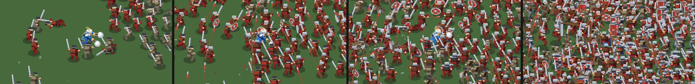

三件事定义了这个项目：

- **人是算出来的，不是画出来的。** 一张精灵图都没有。地上那几百个人共用一副骨架、一套
  程序化步态和一份"这个人身上有什么"的清单（头盔、甲、盾、武器、马……），十三种长相、
  四个可选角色全是在同一份代码上改几个开关。
- **画面是一批三角形。** 所有东西 —— 人、草、树、刀光、血条 —— 都摊平成带深度的四边形和
  椭圆，排一次序，写进一个顶点缓冲，一次提交。
- **不开浏览器就能看画面。** `npm run figures` 自己把图元光栅化成 PNG，`npm run bench` 量
  一帧里 CPU 各花在哪儿。这篇文档里的每一张图都是它跑出来的。

---

## 跑起来

```bash
npm install
npm run dev        # 开发服务器
npm run build      # tsc + vite build
npm run figures    # 离线出图：把下面这些 PNG 全部重新生成一遍
npm run bench      # 离线帧耗时基准
```

**玩家的键**：`WASD`（或按住鼠标左键）走、`Shift` 疾走、`Q/E/R` 三个主动技、`1~4` 用道具、
`ESC` 暂停。完整的一份在 [操作说明.md](操作说明.md)，中英各一段，发布页直接贴。

**开发者的键**（`F1` 调试菜单、`K` 骨架、`L` 平涂档、`T/C/G` 切天气、`-/=` 改颗粒度……）
只在开发构建里存在：那一整段写在 `if (!import.meta.env.DEV) return;` 之后，`vite build`
把它替换成字面量 `false`，整段成为不可达代码被摇掉 —— 产物里连这些字符串都没有。收反馈的
时候玩家按不到跳波次和改血上限，拿回来的手感才是这个游戏的手感。

界面有中英两套，默认跟着浏览器走，`ESC` 那一页上能改。玩家能看到的每一句话都在
`src/ui/text/` 的语言包里 —— 连技能的名字和说明都是（技能表上只剩一个 `nameKey`）。

---

## 一帧里发生什么

```
输入 ──▶ Battle.update ──▶ Scene.draw ──▶ ShapeBatch ──▶ PrimitiveMesh ──▶ PixelSurface ──▶ 屏幕
         推进世界           生成图元        按深度排序      写顶点缓冲        像素量化 + 描边 + 扭曲
```

| 这一步 | 做的事 |
| --- | --- |
| `Battle.update` | 出兵、人群避让与分离、移动、攻击判定、技能推进、掉落、波次 |
| `Scene.draw` | 把场上的东西翻译成图元：地面细节、草、树、人、特效、飘字 |
| `ShapeBatch` | 画家顺序的排序键 = 屏幕行 × 32 + 部件偏移，基数排序一遍 |
| `PrimitiveMesh` | 把排好的图元写进定型数组，一次 draw call |
| `PixelSurface` | 先画进一张小 render target，描边，扭曲，再最近邻整数倍放大到窗口 |

排序是**全局**的，不是先按 y 排人再画树 —— 所以人能走到树后面去，刀光能从头后面扫过来，
盾能挡住自己那条手臂，全部由同一个数决定。

---

## 目录

| 目录 | 行数 | 管什么 |
| --- | ---: | --- |
| `src/characters` | 3.7k | 骨架、两骨 IK、程序化步态、人物渲染、调色板、"这个人身上有什么" |
| `src/render` | 3.0k | 3/4 俯视投影、图元批次、顶点网格、像素表面、扭曲滤镜、场景总装 |
| `src/game` | 7.9k | 战斗循环、角色、人群、技能、波次、属性、存档 |
| `src/data` | 2.4k | 纯数据：兵种表、出兵模板、角色表、平衡曲线、地图、掉落、商店 |
| `src/effects` | 2.9k | 冲击弧、碎片、飘字、脚印、护罩、法相、天降神兵…… |
| `src/world` | 2.6k | 地形烘焙、天气、道具、掉落物 |
| `src/ui` | 6.8k | HUD、菜单、备战、商店 —— 几乎全是 DOM，不占画布 |
| `src/audio` | 0.8k | 音效声部、混音、背景音乐 |
| `src/items` | 0.2k | 道具表、图标、掉落物的样子 |
| `src/core` | 0.1k | 向量和插值。整个项目只有这一个通用工具文件 |
| `tools` | 2.3k | 离线出图、离线基准 |

`assets/` 里只有 HUD 的边框图标和音频。人、地形、特效没有一张图。

---

## 画面是怎么来的

### 一副骨架，一张装备清单

`UnitDef` 是"让一个单位看起来不同于另一个的全部东西"：武器、盾、头盔、甲、盔缨、颈甲、
膝甲、肩甲、甲裙、箭袋、斗篷、马、马衣，加上体格、臂展、身高这几个倍率。骨架和动画代码
是共用的，**只有这张清单在变** —— 这正是程序化画人而不是画十三套精灵图的意义。

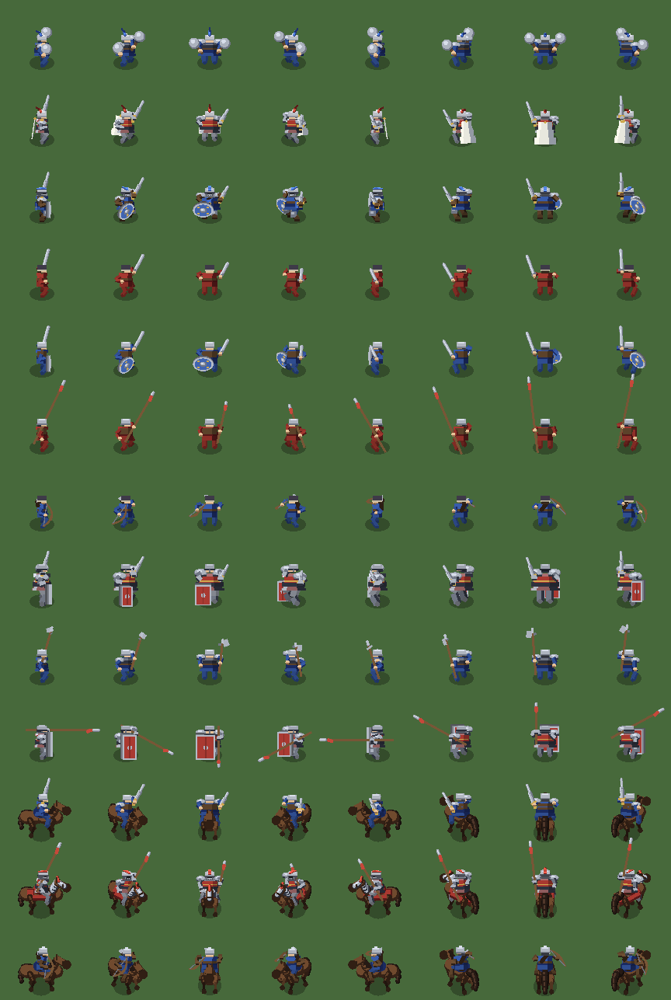

姿势也没有关键帧。步态循环把脚放到地上，胯随之上下起伏、左右摆动，剩下的交给 IK；
相位推进精确跟随速度，所以站定的那只脚不打滑。

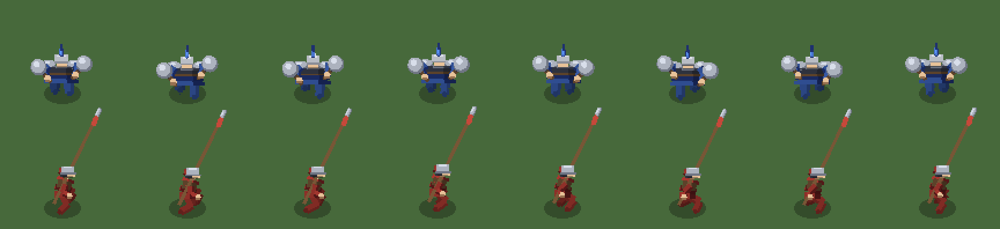

放大了看，区别全在部件上 —— 同一副骨架，换一顶盔、换一面盾、换一杆武器：

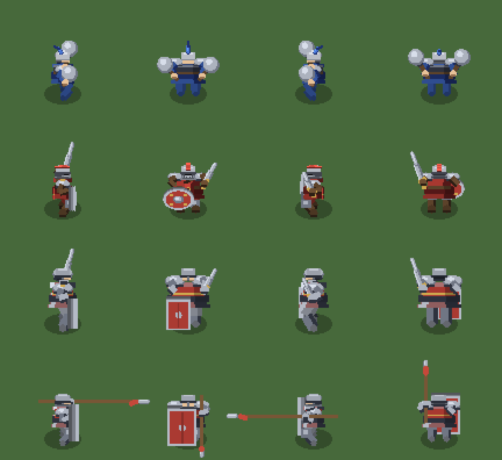

### 颗粒度是一个旋钮

"一个人由多少像素构成"是可以连续调的。下面六格里人在屏幕上一样大，变的只是他由几个像素
拼成 —— 因为整个渲染链路里没有一张位图要被拉伸。

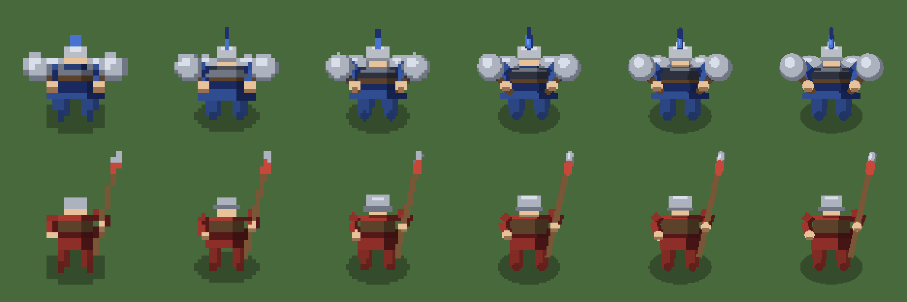

### 两个不相等的压扁系数

3/4 俯视相机只靠两个数作弊：地面平面压到 `0.55`，物体高度压到 `0.68`。

故意**不相等**（正交相机会要求相等）：完全对齐要么把地面压成一条带子，要么把每个人立成
一块立牌。这一对不相等的数让俯视的人读起来是有体积的 —— 头落到肩上，躯干盖住大腿，脚几乎
消失在人自己底下，正是这种重叠让他不像一张纸片。

### 描边只花五个 quad

所有单位画在一张独立的透明层上。合成时把这张层按四个方向各偏一像素、染黑叠一遍，再把原色
那张压上去 —— 于是层上每一个人都被描了一圈一像素的暗边。**整支军队只多五个 quad**，
描边是一次合成通道，不是逐个单位去描。

---

## 一千两百个人是怎么养得起的


同一局跑到第八波，离线基准（`npm run bench`，一台普通开发机）量出来是这样：

```
第 8 波｜预留 571 人，场上 629 人，画 419 人，图元 32140，顶点 233554
battle.update       3.21 ms
characters          1.68 ms   图元 30297
sort+writeVerts     1.73 ms
terrain + 其它      0.25 ms
合计(CPU)           6.87 ms
```

撑住它的是四件事，每一件都在**减少每个人要花的东西**，而不是减少人：

- **三档人物。** 完整（57~78 个图元）→ 平涂（省掉每个部件那条硬边阴影带，38~52 个）→
  色块（4 个 quad）。最后一档在每世界单位不足 0.45 像素时启用：那时一个人只有八像素高，
  构成他的图元大多落在其中三个像素上，色块和完整版无法区分。
- **屏幕外的人没有骨架。** 远处那几百个只是一条数据（位置、朝向、兵种），走进画面才被
  "恢复"成完整的 `Character`。所以"全图 1200"和"场上 629"是两个不同的预算。
- **远处分组决策。** 屏幕外的人每秒只做 10 次决策，还分成六组错开；走近了随时切回逐帧。
- **矩形剔除，不是圆。** 屏幕是矩形，而以视口对角线为半径的圆比它大一倍 —— 实测同屏一千人
  时，圆剔除要画 979 个，矩形只画 686 个。

---

## 世界

地面是**烘成一张 RGBA 图**的：草的明暗成团、土路、水塘、林地、树墙，全部由噪声和一张
布局表算出来，开局烘一次。

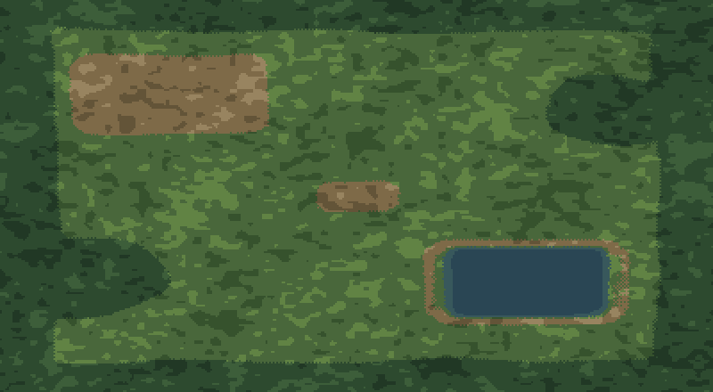

同一张地面，三档缩放 —— 整幅 / 一屏 400 个世界单位 / 出货那一档：

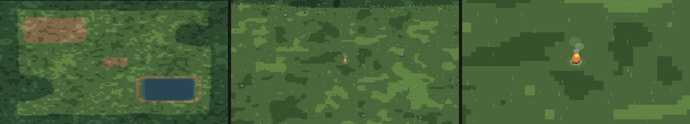

天气是一层叠在上面的状态，不是三套素材。下雨会先在地上积出水洼再连成片，下雪会慢慢盖白；
切换的是"在下什么"，地上湿到什么程度自己跟上来。

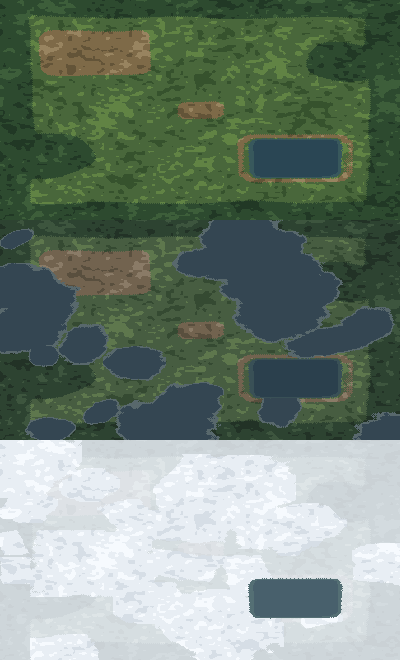

---

## 战斗与技能

伤害只有一条式子：`攻击 × (1 − 防御 ÷ (防御 + 100))`。用递减而不是"攻减防"，是因为减法在
两端都会出事 —— 防御高过攻击就完全免疫，防御低的时候一点防御又毫无感觉。

技能之间的区别是**形状**，不是强度：唯一的强度旋钮是 `power`（这一下比平砍重几档，同时
决定伤害倍率和溅多少碎片）。割草类游戏的群体技能翻来覆去就是四种形状，这四种是骨架：

| 形状 | 怎么结算 |
| --- | --- |
| 前方扇形 / 原地整圈 | `instant`：发招那一帧一次算清 |
| 飞出去的波 | `wave`：波跨帧推进，每帧结算它这一帧扫过的那圈人 |
| 突进走廊 | `lunge`：人跨帧向前冲，每帧结算身体这一帧**走过的线段**（不是落点那个圈 —— 掉帧时一步能跨过整个判定圈，中间的人会被整个跳过去） |
| 跟着人走的罩子 | `aura`：每帧结算碰到罩子的人，带每人免疫窗口 |

后来加的几招各自又长出自己的路径 —— 罩在身上的法相、飞出去的巨剑、从天上砸下来的箭和神兵。
加一种新形状要动 `castSkill` 和 `advanceSkills` 各一处；换一招多远多疼多久，只动 `skills.ts`
里的一条记录。

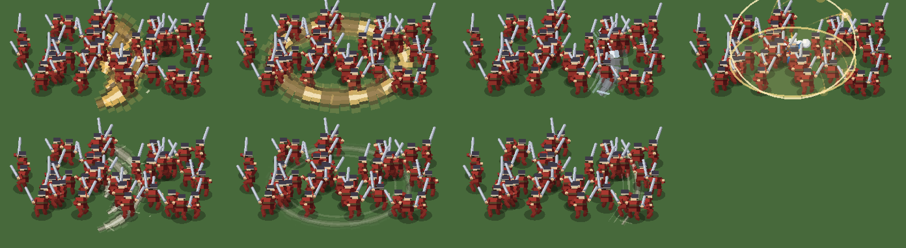

三选一的牌上，每一招演的是**它自己**那一段：起手、持续、收势。走的是战场上那一份画法 ——
牌上看到的就是选完之后屏幕上会出现的东西。

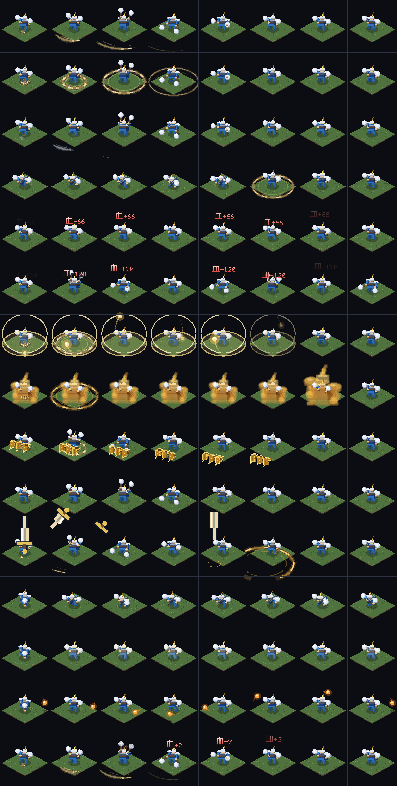

最近加的一招是**神兵天降**：一排金身重甲兵从天上砸下来，端着矛朝前推过去，沿路的人向两侧
飞开。它借的是场上"重甲兵"那个兵种的模型 —— 同一份 `UnitDef`、同一套步态、同一杆锁死的
长矛，只把调色板整个压到金上。人数就是技能等级，一级一个、满级五个。

---

## 数据与机制分家

`src/data/` 全是表，一行代码都不跑：

- `units.ts` —— 十二种兵各自的血、攻、防、速度、范围、频率、经验，和他用哪一副长相。
- `waves.ts` —— 每一波多长、爆多少、密度多少、出哪些兵各占多少。四张地图四张表。
- `heroes.ts` / `balance.ts` —— 角色成长、等级曲线、伤害公式、技能升级的四条倍率。
- `maps.ts` —— 地图的尺寸、种子、布局、出兵模板、难度加成、会遇到谁。

所以"改一个兵种有多强"不用碰任何一张出兵表，"换一张图的节奏"不用碰任何一个兵种。出兵模板
只按 id 配比例，连属性长什么样都不知道。

同一条线还往外走了一步：**玩家能看到的每一句话**也不在逻辑里，而在 `src/ui/text/` 的语言
包中。技能表上写的是 `nameKey: 'skillSweep'`，中文叫横扫、英文叫 SWEEP 由语言包说了算。

---

## 界面

HUD、菜单、备战、商店几乎全是 DOM 加 CSS，不占画布 —— 画布只画游戏世界。备战界面上那些会动的
角色是在 DOM 上开洞让画布透出来：**选图时看到的那个人，就是进去之后走过来的那个人**，
连属性都是同一份数据。

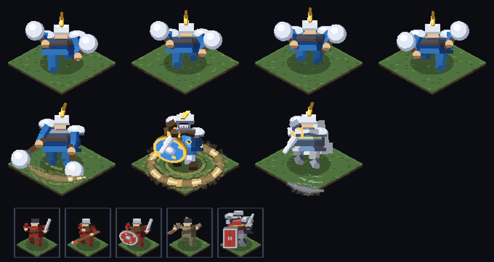

飘字自带一套点阵字模（中文的那几个字是离线烘出来的），和血条、经验条一样按"这一刻发生了
什么"来分色：

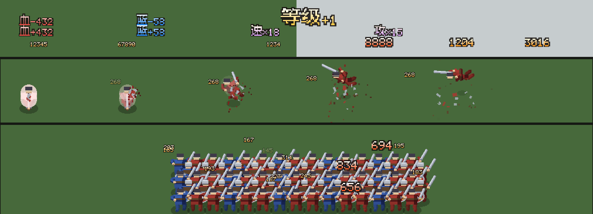

---

## 离线出图：这个项目的验证方式

人物绘制几乎全是数值调参 —— 比例、色阶、深度偏移 —— 而判断一次改动对不对唯一的办法是**看图**。
所以 `tools/preview.ts` 开头两百行是一个**极小的光栅化器**：冒充 Pixi 的图元接收端，把
`ShapeBatch` 的输出自己扫描线填充成 PNG。

```bash
npm run figures   # 二十多张对照图，一次几秒钟，不需要浏览器
```

它和线上走的是**同一份**绘制代码（`drawCharacter`、`drawAegisDome`、`drawFigureStage`……），
不是另写一遍的近似 —— 所以图上验过的就是玩家看到的。这篇 README 里的每一张图都是它的产物，
`screenshots/` 里的是从中挑出来的一份快照。

另一条是 `npm run bench`：不开浏览器，把一帧里 CPU 侧的活各自计时（世界推进、图元生成、
深度排序、写顶点缓冲），并打印场上人数和图元数。加一个兵种、加一招之后跑一次，就知道它贵
不贵。
